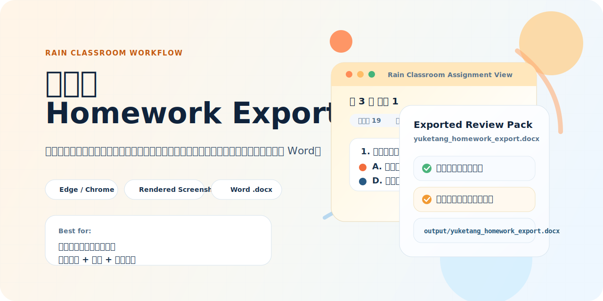

# yuketang-homework-exporter

<p align="center">
  
</p>

<p align="center">
  <a href="README.zh-CN.md">简体中文</a> · English · <a href="README.md">Home</a>
</p>

> A Rain Classroom homework export tool that reuses your already logged-in local browser session and assembles course assignments into a polished Word document.

If you have ever run into problems like these:

- you want to turn Rain Classroom assignments into review notes, but copying one question at a time is painful
- copied questions become garbled because of encrypted fonts
- you want one document containing questions, your submitted answers, platform verdicts, and scores

this project is built for exactly that workflow.

## What it does in one sentence

Give it a Rain Classroom course URL, and it will:

- reuse your locally logged-in browser session
- discover assignment items in the course automatically
- render question screenshots with the original web appearance
- combine questions, your answers, platform verdicts, and scores into a single `.docx`

## Why this project exists

- It is designed specifically for **Rain Classroom**
- No manual cookie, token, or session copying
- It works around Rain Classroom encrypted-font rendering issues
- It supports both `Edge` and `Chrome`
- By default, it only outputs a Word file and avoids saving extra raw data unless you ask for it

## Who it is for

- students who want structured review material from Rain Classroom assignments
- users who want to archive their own submissions
- anyone who wants to stop manually screenshotting and copy-pasting

## Simplest usage

Log in to Rain Classroom in your browser, copy the course page URL, and run:

```bash
python export_yuketang_homework.py --course-url "replace this with your course URL" --output-dir output
```

After it finishes, you should get:

```text
output/yuketang_homework_export.docx
```

This script is **Rain Classroom-specific**, not a generic online course scraper.

## What gets exported

The generated Word document includes:

- assignment titles by chapter
- screenshots of each question
- your submitted answers
- platform verdicts returned by Rain Classroom
- scores

To avoid garbled text caused by encrypted fonts, the script renders the question in the browser first and then inserts screenshots into Word.

## Good fit if you are a beginner

Even if you are new to Python, you can follow the steps below.

You only need to know how to:

- open a terminal
- copy and run a command
- log in to Rain Classroom in a browser

## Before you run it

Make sure these are true:

1. You have `Python 3.10+`
2. You have `Microsoft Edge` or `Google Chrome`
3. You are already logged in to Rain Classroom in that browser
4. You have opened the target course page and copied its URL

Recommended extra step:

5. Fully close the browser before running the script  
Reason: if the same browser profile is still in use, Selenium may fail to open it.

## Step 1: install dependencies

From the project directory, run:

```bash
pip install -r requirements.txt
```

## Step 2: prepare the course URL

The script usually expects a Rain Classroom `studentLog` page URL, like:

```text
https://changjiang.yuketang.cn/v2/web/studentLog/24237213?university_id=2862&platform_id=3&classroom_id=24237213&content_url=
```

How to get it:

1. Open the course in Rain Classroom
2. Navigate to the course page
3. Copy the full URL from the browser address bar

In most cases, passing the full URL is enough. The script will infer `classroom_id` automatically.

## Step 3: run the script

If you use `Edge`, the simplest command is:

```bash
python export_yuketang_homework.py --course-url "replace this with your course URL" --output-dir output
```

If you use `Chrome`, add `--browser chrome`:

```bash
python export_yuketang_homework.py --browser chrome --course-url "replace this with your course URL" --output-dir output
```

By default, the Word file will be generated under:

```text
output/yuketang_homework_export.docx
```

## Copy-paste example

In Windows PowerShell, you can run it in one line:

```powershell
python export_yuketang_homework.py --course-url "https://changjiang.yuketang.cn/v2/web/studentLog/24237213?university_id=2862&platform_id=3&classroom_id=24237213&content_url=" --output-dir output
```

Or in multiple lines:

```powershell
python export_yuketang_homework.py `
  --course-url "https://changjiang.yuketang.cn/v2/web/studentLog/24237213?university_id=2862&platform_id=3&classroom_id=24237213&content_url=" `
  --output-dir output
```

## What if you are not using the default browser profile

If your browser profile is something like:

- `Profile 1`
- `Profile 2`
- a separate work/school profile

you can pass:

```bash
python export_yuketang_homework.py --course-url "your course URL" --profile-directory "Profile 1"
```

If you are unsure:

- the default is usually `Default`
- if you switch between multiple browser identities, you may need `Profile 1` or another profile

## Common options

### `--course-url`

Required.

The Rain Classroom course page URL, usually a `studentLog` page.

### `--browser`

Optional.

- `edge`
- `chrome`

Default:

```text
edge
```

### `--profile-directory`

Optional.

Browser profile directory name, such as:

- `Default`
- `Profile 1`
- `Profile 2`

### `--output-dir`

Optional.

Output directory. Default:

```text
output
```

### `--docx-name`

Optional.

Custom output Word filename, for example:

```bash
python export_yuketang_homework.py --course-url "your course URL" --docx-name my_homework.docx
```

### `--document-title`

Optional.

Sets the first-page title in the Word document.

### `--limit-homeworks`

Optional.

Only process the first N assignments. Good for testing:

```bash
python export_yuketang_homework.py --course-url "your course URL" --limit-homeworks 1
```

### `--save-raw`

Optional.

Save raw API JSON into:

```text
output/raw_json/
```

If you only want the Word file, you usually do not need this.

### `--save-images`

Optional.

Keep rendered question screenshots under:

```text
output/images/
```

By default, screenshots are only used temporarily to build the Word file.

### `--include-source-url`

Optional.

Write the course URL onto the first page of the Word file.

### `--no-headless`

Optional.

Debug mode. A visible browser window will be opened so you can watch the process.

## Output layout

Default output:

```text
output/
└─ yuketang_homework_export.docx
```

With `--save-raw`:

```text
output/
├─ yuketang_homework_export.docx
└─ raw_json/
```

With `--save-images`:

```text
output/
├─ yuketang_homework_export.docx
└─ images/
```

## Common issues

### 1. The browser profile cannot be opened

Most of the time, the browser is still running.

Fix:

1. Fully close `Edge` or `Chrome`
2. Run the script again

### 2. I am logged in, but the script says I am not

Usually one of these is wrong:

- the browser choice
- the profile name
- the actual browser profile where you logged in

Check:

- whether you logged in through `Edge` or `Chrome`
- whether the profile is `Default` or something like `Profile 1`

### 3. Question screenshots still look wrong

This script is specifically designed to reduce that risk, but if it still happens, common causes are:

- the page was not fully loaded
- Rain Classroom changed its frontend behavior
- browser-specific font loading differences

Try:

- `--no-headless`
- `--limit-homeworks 1`
- export one assignment first for debugging

### 4. I just want to see if the script works first

Recommended:

```bash
python export_yuketang_homework.py --course-url "your course URL" --limit-homeworks 1 --no-headless
```

Run one assignment first, then remove `--limit-homeworks 1` for the full export.

## Privacy notes

The script does not hardcode your password, cookies, or tokens into the repository, but keep this in mind:

- it reuses your local browser profile session
- if you enable `--save-raw`, raw JSON may contain:
  - your submitted answers
  - scores
  - submission timestamps
  - course information
  - teacher information
- the exported Word file itself may also contain course content and your answer records

If you are publishing this project on GitHub:

- do not commit your generated `output/`
- do not commit `raw_json/`
- do not commit `images/`
- do not commit generated `.docx` files

## Compliance reminder

Only export content you are authorized to access, and make sure to check:

- Rain Classroom platform terms
- your school or course rules
- whether course content may be redistributed

## Known limitations

- currently optimized mainly for Windows Edge/Chrome workflows
- strongly depends on an already logged-in Rain Classroom browser session
- if Rain Classroom changes its frontend or APIs, the script may need updates

## License

[MIT](LICENSE)
