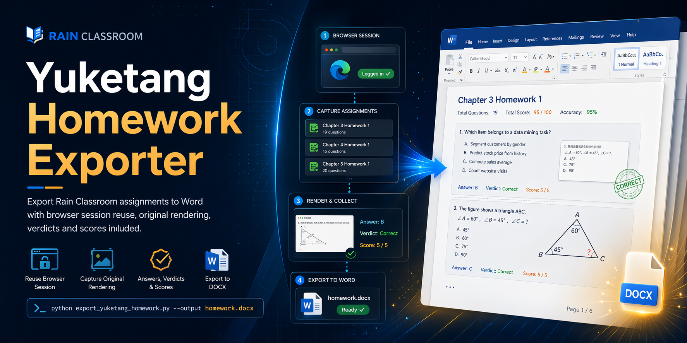

# yuketang-homework-exporter

<p align="center">
  
</p>

<p align="center">
  简体中文 · <a href="README.en.md">English</a> · <a href="README.md">Home</a>
</p>

> 一个基于 **雨课堂** 的作业导出工具：复用你本机浏览器里已经登录好的雨课堂，把课程作业按章节整理成一个 Word 文档。

如果你曾经遇到过这些麻烦：

- 想把雨课堂作业整理成复习资料，只能一题一题复制
- 直接复制题目会乱码，尤其是加密字体部分
- 想把“题目 + 自己的作答 + 平台判定 + 得分”放进同一份文档

这个项目就是为这种场景准备的。

## 一句话能做什么

给它一个雨课堂课程链接，它会：

- 复用你本机浏览器里已经登录的雨课堂会话
- 自动找到课程里的作业
- 把题目按原网页效果渲染成截图
- 将题目、你的作答、平台判定结果、得分汇总到一个 `.docx`

## 这个项目的特点

- 专门针对 **雨课堂平台**
- 不需要你手动复制 Cookie、Token、Session
- 解决雨课堂题目加密字体导致的乱码问题
- 支持 `Edge` 和 `Chrome`
- 默认只生成 Word，尽量少在本地留下敏感原始数据

## 最适合什么人

- 想整理雨课堂作业做复习资料的人
- 想把个人作答导出留档的人
- 不想手动截图、手动复制粘贴的人

## 最简单的使用方式

先在浏览器里登录雨课堂，复制课程页面链接，然后运行：

```bash
python export_yuketang_homework.py --course-url "把这里替换成你的课程链接" --output-dir output
```

跑完以后，你会得到：

```text
output/yuketang_homework_export.docx
```

这个脚本 **只针对雨课堂**，不是通用的网课平台抓取器。

## 它会导出什么

生成的 Word 里会包含：

- 每章作业标题
- 每道题的截图
- 你的作答
- 雨课堂平台返回的判定结果
- 得分

为了避免雨课堂题目里的加密字体乱码，脚本会直接用浏览器渲染题目，再截图插入 Word。

## 适合谁

如果你是第一次接触 Python，也可以照着下面一步一步做。

你只需要会这几件事：

- 打开命令行
- 复制一条命令回车
- 能在浏览器里登录雨课堂

## 运行前准备

开始前先确认这 4 件事：

1. 你的电脑装了 `Python 3.10+`
2. 你的电脑装了 `Microsoft Edge` 或 `Google Chrome`
3. 你已经在浏览器里登录了雨课堂
4. 你已经打开过目标课程页面，并拿到了课程链接

建议再做一件事：

5. 运行脚本前，把对应浏览器窗口完全关闭  
原因：浏览器正在占用同一个 Profile 时，Selenium 可能打不开这份登录资料。

## 第一步：安装依赖

进入项目目录后，运行：

```bash
pip install -r requirements.txt
```

如果你看到安装成功，就可以继续。

## 第二步：准备课程链接

这个脚本最常用的是雨课堂课程的 `studentLog` 页面链接，类似这样：

```text
https://changjiang.yuketang.cn/v2/web/studentLog/24237213?university_id=2862&platform_id=3&classroom_id=24237213&content_url=
```

怎么拿：

1. 打开雨课堂课程页面
2. 进入这门课
3. 复制浏览器地址栏里的完整链接

一般直接把完整链接传给脚本就行，脚本会自动从里面识别 `classroom_id`。

## 第三步：直接运行

如果你用的是 `Edge`，最简单的命令是：

```bash
python export_yuketang_homework.py --course-url "把这里替换成你的课程链接" --output-dir output
```

如果你用的是 `Chrome`，就加上 `--browser chrome`：

```bash
python export_yuketang_homework.py --browser chrome --course-url "把这里替换成你的课程链接" --output-dir output
```

运行完成后，默认会在：

```text
output/
```

下面生成一个 Word 文件：

```text
output/yuketang_homework_export.docx
```

## 一条能直接照抄的示例命令

Windows `PowerShell` 里可以直接写成一行：

```powershell
python export_yuketang_homework.py --course-url "https://changjiang.yuketang.cn/v2/web/studentLog/24237213?university_id=2862&platform_id=3&classroom_id=24237213&content_url=" --output-dir output
```

如果你更喜欢分行写，可以这样：

```powershell
python export_yuketang_homework.py `
  --course-url "https://changjiang.yuketang.cn/v2/web/studentLog/24237213?university_id=2862&platform_id=3&classroom_id=24237213&content_url=" `
  --output-dir output
```

注意：

- `PowerShell` 换行符是反引号 `` ` ``
- `cmd` 里常用的是 `^`
- 最省事的方法就是先写成一整行

## 如果不是默认浏览器配置怎么办

有些人浏览器不是默认配置，比如：

- `Profile 1`
- `Profile 2`
- 单独的工作账号配置

这时可以加：

```bash
python export_yuketang_homework.py --course-url "你的课程链接" --profile-directory "Profile 1"
```

如果你不确定自己是不是默认配置：

- 默认一般是 `Default`
- 如果你平时在浏览器里切过多个头像/用户，很可能不是 `Default`

## 常用参数说明

### `--course-url`

必填。

就是雨课堂课程页面链接，通常是 `studentLog` 页面。

### `--browser`

可选。

- `edge`
- `chrome`

默认是：

```text
edge
```

### `--profile-directory`

可选。

浏览器配置目录名，常见值：

- `Default`
- `Profile 1`
- `Profile 2`

### `--output-dir`

可选。

导出目录，默认：

```text
output
```

### `--docx-name`

可选。

自定义导出的 Word 文件名，例如：

```bash
python export_yuketang_homework.py --course-url "你的课程链接" --docx-name my_homework.docx
```

### `--document-title`

可选。

设置 Word 首页标题。

### `--limit-homeworks`

可选。

只处理前 N 份作业，适合先测试：

```bash
python export_yuketang_homework.py --course-url "你的课程链接" --limit-homeworks 1
```

### `--save-raw`

可选。

把原始接口 JSON 保存下来，目录会是：

```text
output/raw_json/
```

如果你只是想拿 Word，通常不用开这个参数。

### `--save-images`

可选。

把题目截图也额外保留下来，目录会是：

```text
output/images/
```

默认不保留，图片只会临时用于写入 Word。

### `--include-source-url`

可选。

把课程 URL 写到 Word 首页。

### `--no-headless`

可选。

调试模式。运行时会真的弹出浏览器窗口，方便你观察脚本在做什么。

## 输出目录长什么样

默认情况下：

```text
output/
└─ yuketang_homework_export.docx
```

如果你加了 `--save-raw`：

```text
output/
├─ yuketang_homework_export.docx
└─ raw_json/
```

如果你加了 `--save-images`：

```text
output/
├─ yuketang_homework_export.docx
└─ images/
```

## 最常见的问题

### 1. 运行时报浏览器打不开 Profile

大多数时候是因为浏览器还开着。

解决办法：

1. 完全关闭 `Edge` 或 `Chrome`
2. 再重新运行脚本

### 2. 明明登录了，还是提示没登录

通常是这几种原因：

- 你传的浏览器不对
- 你传的 Profile 不对
- 你登录雨课堂用的不是这个浏览器配置

先检查：

- 你到底登录在 `Edge` 还是 `Chrome`
- 是 `Default` 还是 `Profile 1`

### 3. 题目截图乱码

这个脚本的设计就是为了尽量避免这个问题。  
如果还是有异常，通常是：

- 页面没加载完
- 平台前端改版了
- 浏览器环境差异导致字体没正常加载

可以先试：

- 加 `--no-headless`
- 加 `--limit-homeworks 1`
- 先只导出一份作业调试

### 4. 想先试试脚本能不能跑通

最推荐这条：

```bash
python export_yuketang_homework.py --course-url "你的课程链接" --limit-homeworks 1 --no-headless
```

先跑 1 份作业，确认没问题后，再去掉 `--limit-homeworks 1` 跑完整导出。

## 隐私说明

脚本本身不会把你的密码、Cookie、Token 写进代码仓库，但请注意：

- 它会复用你本机浏览器当前 Profile 的登录态
- 如果开启 `--save-raw`，原始 JSON 里可能包含：
  - 你的作答记录
  - 得分
  - 提交时间
  - 课程信息
  - 教师信息
- 如果你分享导出的 Word，本身也可能包含课程内容和作答结果

如果你准备把这个项目放到 GitHub：

- 不要提交你自己跑出来的 `output/`
- 不要提交 `raw_json/`
- 不要提交 `images/`
- 不要提交生成好的 `.docx`

## 合规提醒

请只导出你自己有权限访问的雨课堂内容，并自行确认：

- 雨课堂平台条款
- 学校或课程方的使用规则
- 课程内容是否允许进一步传播

## 已知限制

- 目前主要按 Windows 的 Edge/Chrome 使用方式做了适配
- 强依赖浏览器里已经登录的雨课堂
- 如果雨课堂前端或接口改版，脚本可能需要调整

## License

[MIT](LICENSE)
